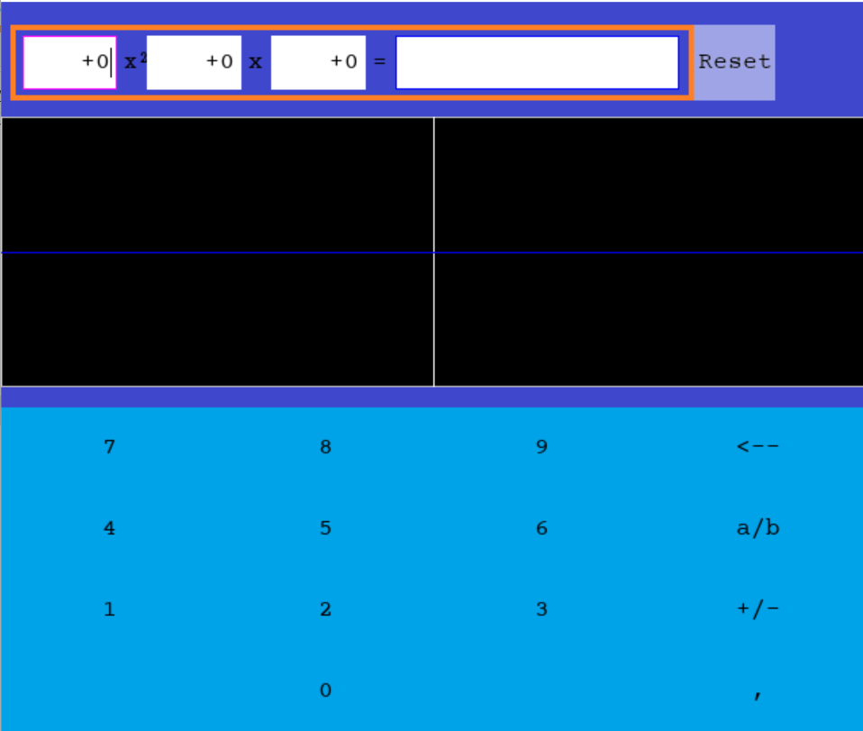
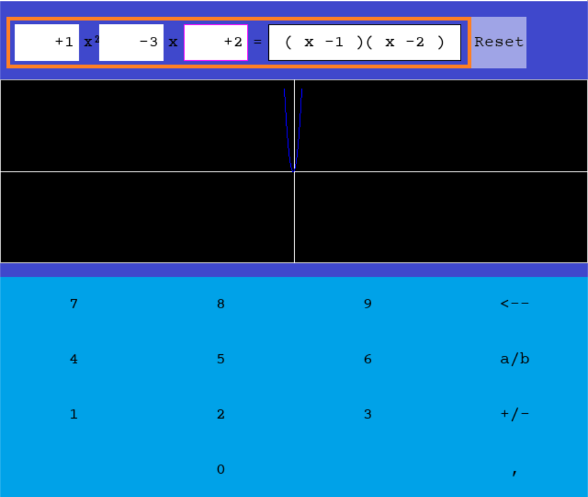
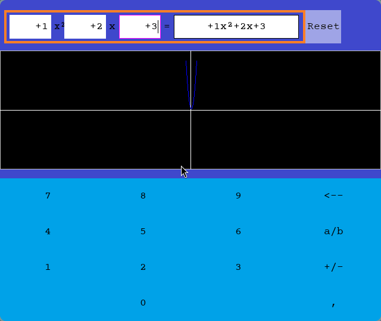

# Polynomial Factorization and Visualization with SDL2 and SDL_ttf



## Table of Contents

- [Overview](#overview)
- [Usage](#usage)
- [Examples](#examples)
- [Notes](#notes)

## Overview

This C program utilizes SDL2 for graphics rendering and SDL_ttf for text rendering to factorize quadratic polynomials and visualize their graphs. If the polynomial is not factorizable, it displays the polynomial as it is.

## Usage

1. Clone this repository to your computer

```bash
https://github.com/RyanTk03/factorio.git
cd 
```

2. Compile the program using a C compiler compatible with SDL2 and SDL_ttf
   
   Make sure to install SDL2 and SDL_ttf on your system beforehand
   
   SDL2: [Release 2.28.4 · libsdl-org/SDL · GitHub](https://github.com/libsdl-org/SDL/releases/tag/release-2.28.4) 
   
   SDL_ttf: [Releases · libsdl-org/SDL_ttf · GitHub](https://github.com/libsdl-org/SDL_ttf/releases)

```bash
gcc -o factorio factorio/src/*.c -lSDL2 -lSDL2_ttf -lm
```

**Or**

```bash
make
```

3. Run the program

```bash
./factorio
```

## Examples

**Example 1 - Factoriazable Polynomial**
When the program factors a quadratic polynomial, it displays it as follows:

Enter the coefficient a of the polynomial: 1
Enter the coefficient b of the polynomial: -3
Enter the coefficient c of the polynomial: 2
Factored polynomial: (x - 2)(x - 1)



**Example 2 - Unfactoriazable Polynomial**
When the polynomial is not factorizable, the program displays the polynomial as it is:
Enter the coefficient a of the polynomial: 1
Enter the coefficient b of the polynomial: 2
Enter the coefficient c of the polynomial: 3
Unfactored polynomial: 1x^2 + 2x + 3



## Note:

⚠️ The code reflects my skill level at the time – with inconsistent naming, long functions, and an overall "spaghetti" structure. While not clean or production-ready, this project played a big role in my learning path and growth as a developer.
