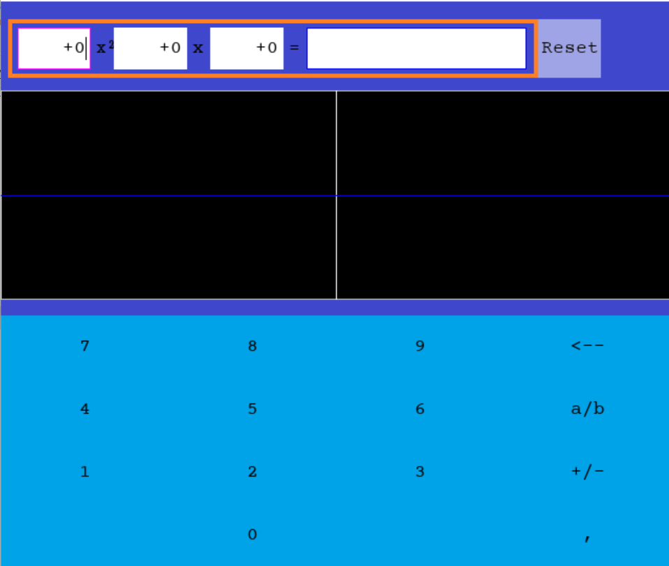
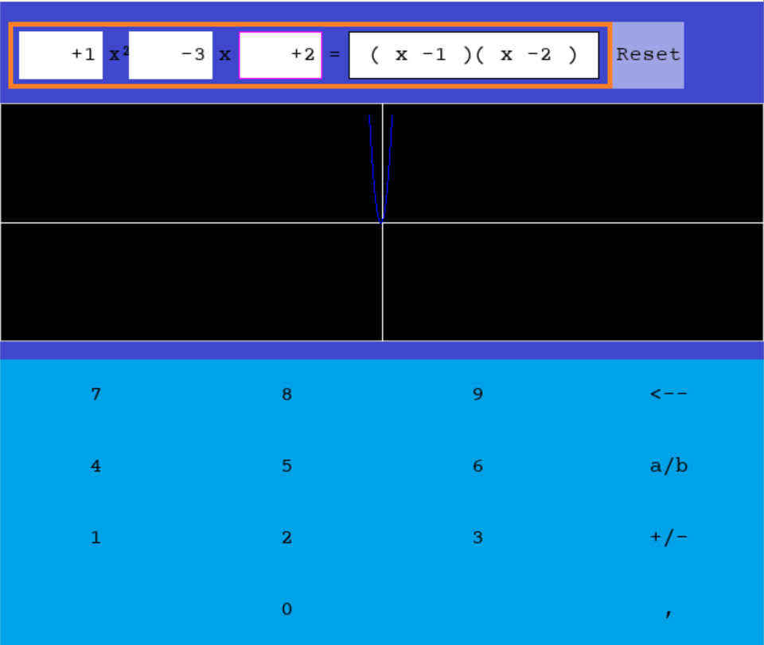
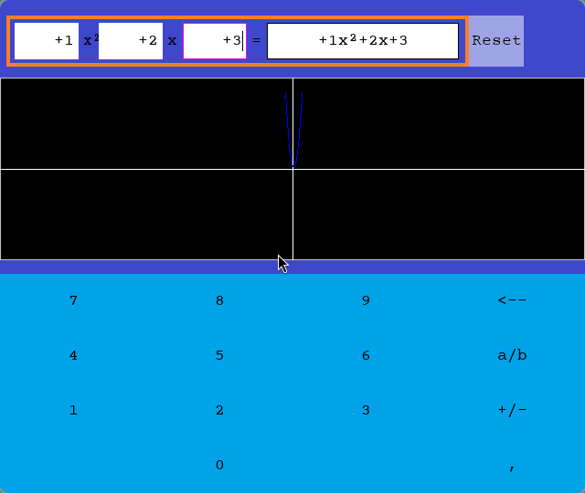

# Polynomial Factorization and Visualization with SDL2 and SDL_ttf



## Table of Contents
- [Overview](#overview)
- [Usage](#usage)
- [Installation](#installation)
- [Examples](#examples)
- [Notes](#notes)

## Overview

This C program utilizes SDL2 for graphics rendering and SDL_ttf for text rendering to factorize quadratic polynomials and visualize their graphs. If the polynomial is not factorizable, it displays the polynomial as it is.

## Usage

1. Clone this repository to your computer.

```bash
git clone https://github.com/your-user/your-project.git
cd app

# Compile the program using a C compiler compatible with SDL2 and SDL_ttf. Make sure to install SDL2 and SDL_ttf on your system beforehand.
make

# Run the program :
./factorio
```
SDL2: https://github.com/libsdl-org/SDL/releases/tag/release-2.28.4
SDL_ttf: https://github.com/libsdl-org/SDL_ttf/releases

Examples
Example 1 - Factored Polynomial
When the program factors a quadratic polynomial, it displays it as follows:

Enter the coefficient a of the polynomial: 1
Enter the coefficient b of the polynomial: -3
Enter the coefficient c of the polynomial: 2
Factored polynomial: (x - 2)(x - 1)


Example 2 - Unfactored Polynomial
When the polynomial is not factorizable, the program displays the polynomial as it is:
Enter the coefficient a of the polynomial: 1
Enter the coefficient b of the polynomial: 2
Enter the coefficient c of the polynomial: 3
Unfactored polynomial: 1x^2 + 2x + 3


Note:
Please note that the graph visualization function is not entirely polished and may have graphical issues. I'm working on improving this feature. If you have any suggestions or contributions, feel free to share them.

Don't hesitate to open issues or contribute to the project to enhance this feature and resolve existing graphical problems.
